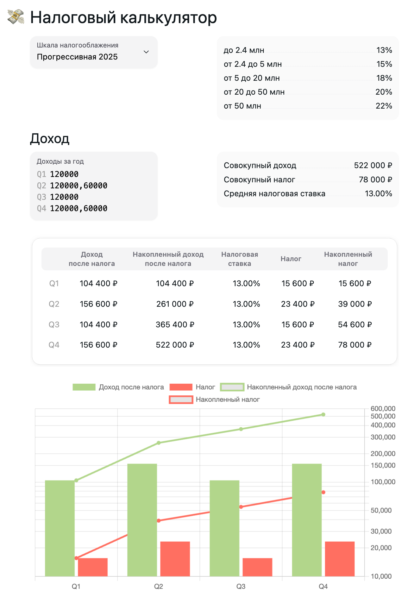

# [Налоговый калькулятор для РФ](https://tenorok.github.io/tax-calc/)

[Налоговый калькулятор](https://tenorok.github.io/tax-calc/), поддерживающий несколько шкал налогооблажения:

-   плоская 13%
-   [прогрессивная 2021](https://www.nalog.gov.ru/rn58/news/activities_fts/10414275/)
-   [прогрессивная 2025](https://www.nalog.gov.ru/rn05/news/activities_fts/15068109/)

---

## Про разработку

**Доступные команды** описаны в хелпе: `task --help`:

-   локальный запуск: `task start`
-   запуск тестов: `task test`

**Выкладка:**

1. `git checkout gh-pages`
1. `task build`
1. `git commit && push`
